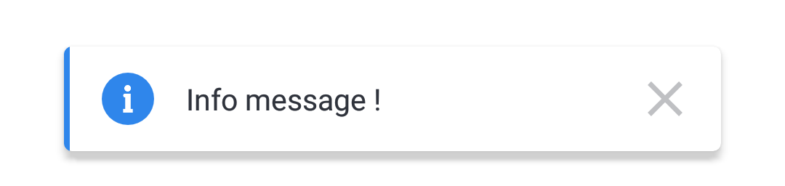
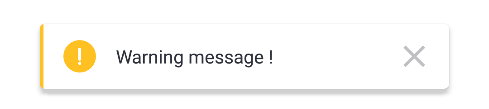
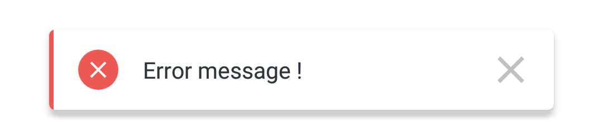

🌈 Snackify - A Beautiful Snackbar Library for Android Kotlin
========================

## Introduction
This library is build on top of Snackbar 

Type of Snackbars
-----
👉 Success Snackbar <br/>
 <br/> <br/>
👉 Info Snackbar <br/>
 <br/> <br/>
👉 Warning Snackbar <br/>
 <br/> <br/>
👉 Error Snackbar <br/>


Usage
-----

This library allows you to use :
```kotlin
//Success Snackbar
Snackify.success(findViewById(android.R.id.content), "Success message !", Snackify.LENGTH_LONG).show()

//Info Snackbar
Snackify.info(findViewById(android.R.id.content), "Info message !", Snackify.LENGTH_LONG).show()

//Warning Snackbar
Snackify.warning(findViewById(android.R.id.content), "Warning message !", Snackify.LENGTH_LONG).show()

//Error Snackbar
Snackify.error(findViewById(android.R.id.content), "Error message !", Snackify.LENGTH_SHORT).show()
```

## Setup

Currently available via [JitPack][1].

To use it, add the jitpack maven repository to your `build.gradle` file:
```gradle
repositories {
  ...
  maven { url "https://jitpack.io" }
  ...
}
```
and add the dependency:
```gradle
dependencies {
  ...
  implementation 'com.github.Musfick:Snackify:0.1.2'
  ...
}
```

## License

    Copyright 2021 Musfick Jamil

    Licensed under the Apache License, Version 2.0 (the "License");
    you may not use this file except in compliance with the License.
    You may obtain a copy of the License at

       http://www.apache.org/licenses/LICENSE-2.0

    Unless required by applicable law or agreed to in writing, software
    distributed under the License is distributed on an "AS IS" BASIS,
    WITHOUT WARRANTIES OR CONDITIONS OF ANY KIND, either express or implied.
    See the License for the specific language governing permissions and
    limitations under the License.


[1]: https://jitpack.io
